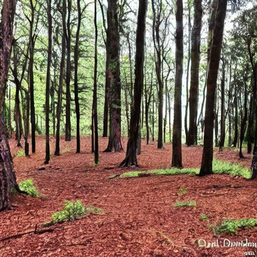
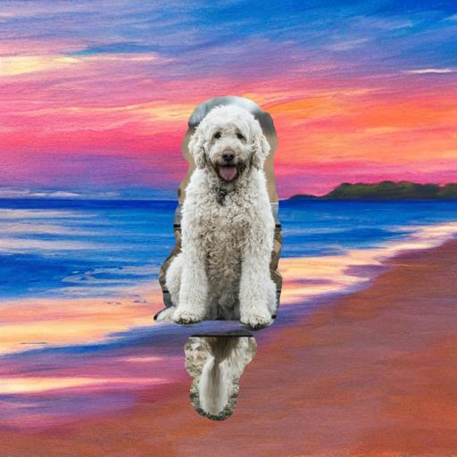

# Stable Diffusion Image Generation and Editing
## Description

This code uses the Stable Diffusion model to generate and edit images based on text prompts. It includes examples for generating new images, inpainting (filling missing areas), and replacing backgrounds.

## Installation

To run this code, you'll need to install the required libraries. Run the following commands:

```bash
!pip install torch torchvision transformers diffusers
!pip install pillow requests
```
## Usage
### Image Generation

To generate a new image based on a text prompt:
```Python
prompt = "A futuristic cityscape"
result = pipe(prompt=prompt).images[0]
result.save("generated_image.jpg")
```


### Inpainting
To fill a missing area in an image:
```Python
input_image = Image.open("input_image.png").convert("RGB")
mask_image = Image.open("mask_image.png").convert("L")
prompt = "Fill the missing area with a forest background"
result = pipe(prompt=prompt, init_image=input_image, mask_image=mask_image).images[0]
result.save("Painted_image.jpg")
```




### Background Replacement
To replace the background of an image:
```Python
prompt = "A beach with a sunset"
new_background = pipe(prompt=prompt).images[0]
original_image = Image.open("input_image.png").convert("RGB")
mask_image = Image.open("mask_image.png").convert("L")
combined_image = Image.composite(original_image, new_background, mask_image)
combined_image.save("path_to_save_combined_image.jpg")
```




### Models and Tokens
This code uses the CompVis/stable-diffusion-v1-4 model from Hugging Face. You'll need to replace with your own Hugging Face token.

### License
This code is licensed under the MIT License.
